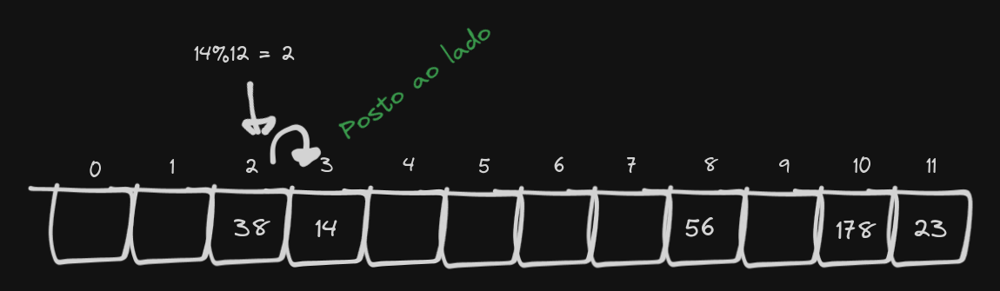
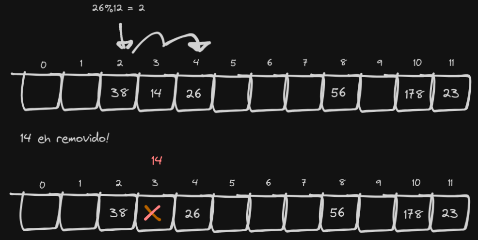
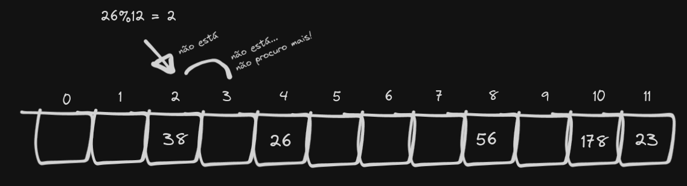
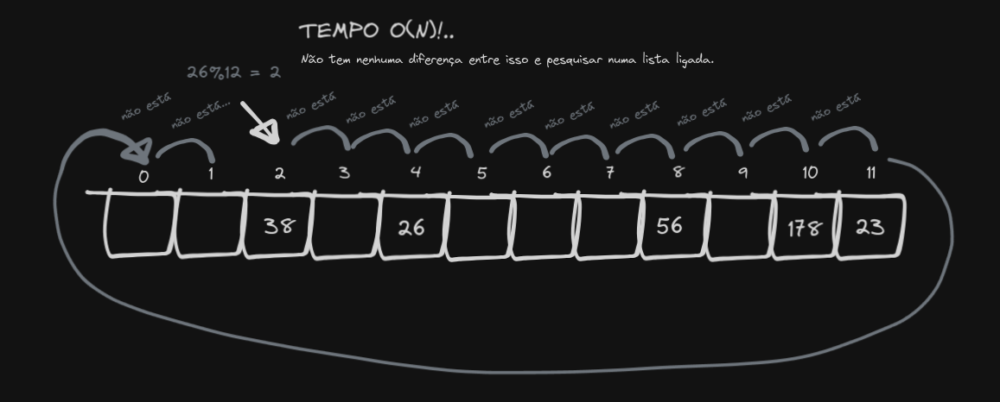
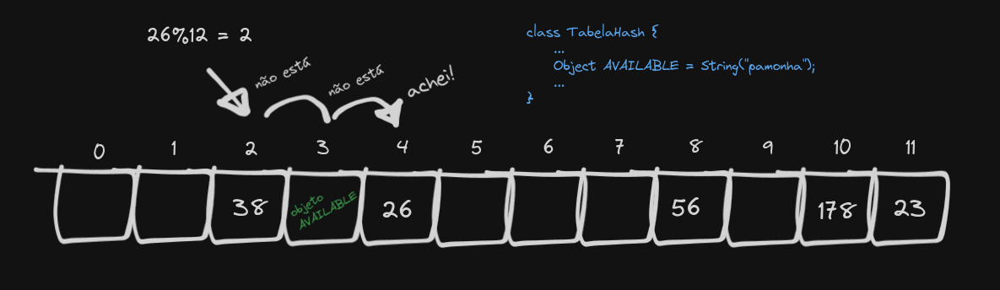
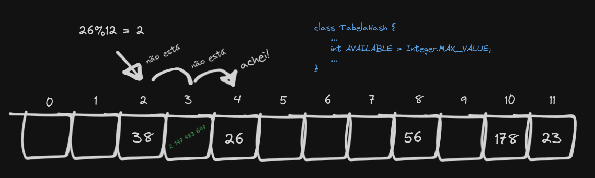
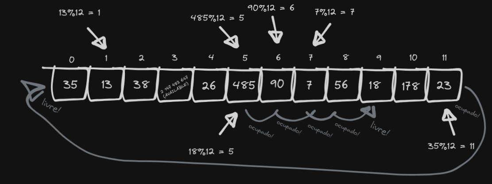

# Hashtable (tabela de dispersão)

Índice:

- A função de dispersão (hash)
- Inserção
- Lidando com colisões: Linear Probing
- Lidando com colisões: Hashing duplo

A hashtable é uma implementação do dicionário, que por meio de uma <b>função de dispersão</b> consegue dispôr os elementos na lista de forma "aleatória", mantendo a complexidade temporal da pesquisa em O(1).

A ideia é que, usando um array, a função de dispersão defina a posição do elemento sendo inserido. Como essa posição é calculada em (O(1)), a pesquisa usando a mesma chave vai chamar a função de dispersão e acessar direto o endereço do elemento no array, em tempo constante.

## 1. A função de dispersão

A função de dispersão precisa levar em conta o tamanho do array, caso contrário ela pode usar somente parte do array (o que levaria a mais <u>colisões</u>) ou fazer inserções em endereços que estão fora da área de memória.

Uma função de dispersão comum seria h(x) = x%tamanhoDoArray.

## 2. Inserção

Considere um array de tamanho 12:


Vamos inserir alguns números. 23, 178, 38 e 56. Ficamos assim:


Como a posição do número no array vai depender do resto da divisão dele por 12, você pode esperar que haja uma distribuição uniforme ao longo do array.

Mas vez ou outra o resultado da função hash pra um elemento vai ser uma posição que já está ocupada, e temos que resolver isso de alguma forma.

## 3. Lidando com colisões

Vamos pegar o exemplo do item 2 e adicionar o número <b>14</b>.


Ooops, ocupado. Há duas formas mais comuns de lidar com colisões:

### 3.1 Encadeamento

Uma forma simples de resolver o problema das colisões é armazenar os itens numa sequência (lista, array). Você pode desde o início usar um array de listas ligadas, por exemplo. No meu caso, eu criei um objeto "Elemento" que vai armazenar o valor do elemento e uma referência para o próximo elemento naquele endereço, caso haja um.

Vejamos:


Dessa forma, nosso algoritmo de pesquisa vai precisar iterar sobre todos os elementos ligados ao primeiro do índice, para conferir se o item buscado não está lá.

### 3.2 Endereçamento

<u>Endereçamento</u> é um método onde arranjamos o elemento em outra posição no array, e pode ser feito tradicionalmente de duas formas:

### 3.2.1 Linear probing

Linear probing consiste em deslocar o elemento para o índice seguinte. Retomando o exemplo da imagem do item 3:



E então nossa busca precisa passar por todos os espaços preenchidos até achar um elemento vazio.

Mas há um problema aí. Vamos considerar o seguinte: Inserimos o número 26 na tabela, que também depois da função de hashing acaba caindo no índice 2. Depois, por algum motivo, removemos o elemento 14.



Até aí tudo bem, NÉ?. Mas vamos fazer uma pesquisa pelo número 26:



O "buraco" que deixamos ao remover o número 14 faz com que não consigamos chegar no 26, que foi posto na "mesma posição" mas que agora não pode ser acessado. Você pode até dizer que é só procurarmos no resto do array, mas isso torna a complexidade temporal da busca O(N), fazendo com que nossa implementação vire basicamente uma lista ligada:



A solução pra o problema do buraco é, quando fizermos uma remoção, utilizarmos um símbolo, que indica que ali é um espaço vazio, mas que o próximo elemento deve ser conferido também. Coleguinha chama esse símbolo de "AVAILABLE".



Ufa! Temos uma tabela hash com linear probing funcional. O objeto AVAILABLE simboliza que aquele índice pode ser passado numa pesquisa, mas que também está disponível (no inglês, available) para inserção.

Porém, eu não gosto dessa abordagem. Pra usar ela, o tipo do atributo que usamos como chave para nossos valores na table precisa ser Object, e isso não é tão limpo: generalizar o tipo de todo um conjunto pra satisfazer uma condição excepcional.

........ COMO EU AINDA NÃO CITEI TAMANHO MÁXIMO DO ARRAY, É BOM DEIXAR ESSA PARTE PRA MAIS PRA FRENTE.

.....TAMBÉ LEMBRAR DE CITAR QUE É NECESSÁRIO CHECAR O ELEMENTO DO INDÍCE ATUAL CONTRA O SIMBOLO AVAILABLE.

Acho mais interesante usarmos a seguinte opção: O nosso "available" será um número que não poderemos usar. O ideal pra isso é o número máximo que o tipo do atributo da chave suportar. Como uso **int**, nosso símbolo de available será o número 2 147 483 647. Em java, podemos acessar esse valor por meio de 

```java
Integer.MAX_VALUE
```

Logo, nosso exemplo ficaria assim:



Vamos adicionar mais alguns elementos:




Note que a tabela é circular.


Talvez você tenha sacado que há um problema: Com o tempo, a busca <u>degenera</u>. Imagine que, se você sempre trata a colisão deslocando um elemento pra direita, <u>a busca pode precisar checar todos os elementos seguintes até achar a chave pesquisada</u>, ou mesmo simplesmente constatar que ela não está na tabela. 


Pra evitar isso, precisamos garantir que o array não fique muito cheio, sempre mantendo o preenchimento abaixo de 50% aumentando o tamanho.

------ imagem

### 3.2.2 Hashing duplo

Uma segunda função hash, que encontra uma posição pra um elemento caso haja uma colisão.
...................

### 4. Anotações para atualizações posteriores

- Há alguma variedade nas funções de dispersão? Se sim, qual?
- Colocar a função de busca utilizando encadeamento