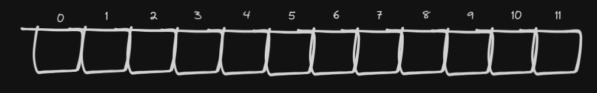
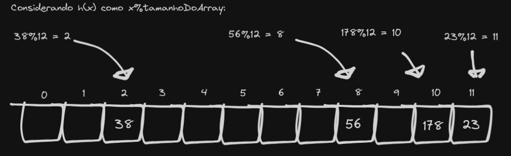
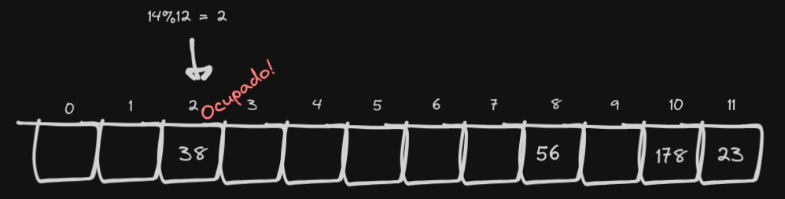
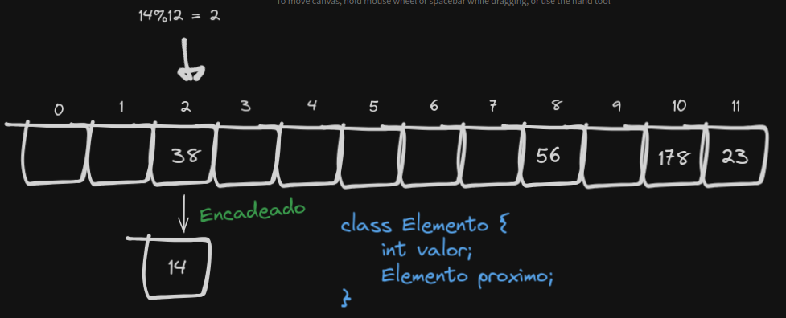

# Hashtable (tabela de dispersão)

Índice:
- A função de dispersão (hash)
- Inserção
- Lidando com colisões: Linear Probing
- Lidando com colisões: Hashing duplo

A hashtable é uma implementação do dicionário, que por meio de uma <b>função de dispersão</b> consegue dispôr os elementos na lista de forma "aleatória", mantendo a complexidade temporal da pesquisa em O(1).

A ideia é que, usando um array, a função de dispersão defina a posição do elemento sendo inserido. Como essa posição é calculada (O(1)), a pesquisa usando a mesma chave vai chamar a função de dispersão e acessar direto o endereço do elemento no array, em tempo constante.

## 1. A função de dispersão

A função de dispersão precisa levar em conta o tamanho do array, caso contrário ela pode usar somente parte do array (o que levaria a mais <u>colisões</u>) ou fazer inserções em endereços que estão fora da área de memória.

Uma função de dispersão comum seria h(x) = x%tamanhoDoArray.

## 2. Inserção

Considere um array de tamanho 12:

Vamos inserir alguns números. 23, 178, 38 e 56. Ficamos assim:

Como a posição do número no array vai depender do resto da divisão dele por 12, você pode esperar que haja uma distribuição uniforme ao longo do array.

Mas vez ou outra o resultado da função hash pra um elemento vai ser uma posição que já está ocupada, e temos que resolver isso de alguma forma.

## 3. Lidando com colisões

Vamos pegar o exemplo do item 2 e adicionar o número <b>14</b>.

Ooops, ocupado. Há duas formas mais comuns de lidar com colisões:

### 3.1 Encadeamento

Uma forma simples de resolver o problema das colisões é armazenar os itens numa sequência (lista, array). Você pode desde o início usar um array de listas ligadas, por exemplo. No meu caso, eu criei um objeto "Elemento" que vai armazenar o valor do elemento e uma referência para o próximo elemento naquele endereço, caso haja um.

Vejamos:

Dessa forma, nosso algoritmo de pesquisa vai precisar iterar sobre todos os elementos ligados ao primeiro do índice, para conferir se o item buscado não está lá.

### 3.2 Endereçamento

<u>Endereçamento</u> é um método onde arranjamos o elemento em outra posição no array, e pode ser feito tradicionalmente de duas formas:

### 3.2.1 Linear probing

Linear probing consiste em deslocar o elemento para o índice seguinte.

------ imagem

Até aí tudo bem, porém surge um problema: Com o tempo, a busca <u>degenera</u>. Imagine que, se você sempre trata a colisão deslocando um elemento pra esquerda, <u>a busca pode precisar checar todos os elementos seguintes até achar a chave pesquisada.</u> Pra evitar isso, precisamos garantir que o array não fique muito cheio, sempre mantendo o preenchimento abaixo de 50% aumentando o tamanho.

------ imagem

Além disso, quando fizermos uma remoção, é importante colocar um elemento simbólico no lugar para garantir que uma próxima busca possa passar ali e checar o elemento seguinte.

------ imagem

### 3.2.2 Hashing duplo

Uma segunda função hash, que encontra uma posição pra um elemento caso haja uma colisão.
...................

### 4. Anotações para atualizações posteriores

- Há alguma variedade nas funções de dispersão? Se sim, qual?
- Colocar a função de busca utilizando encadeamento